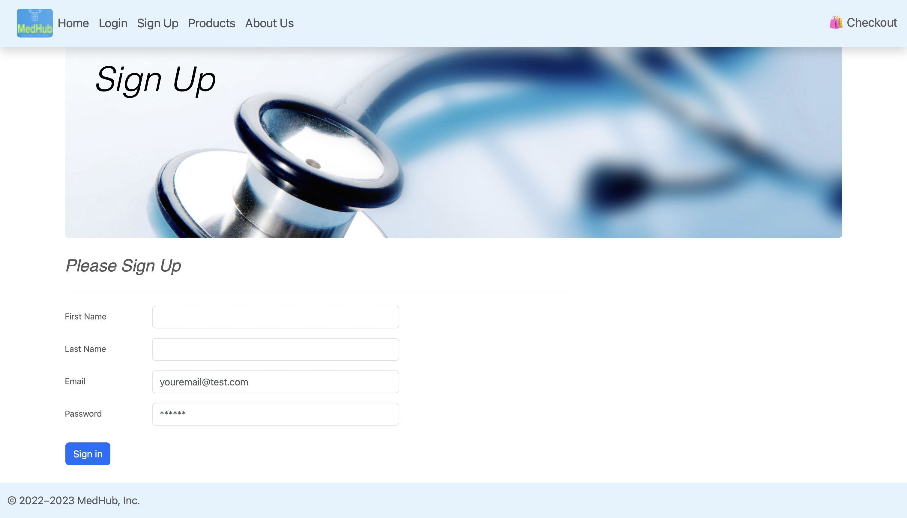

# MedHub [](https://opensource.org/licenses/MIT)


## Table of Contents
- [Description](#description)
- [Features](#features)
- [Getting Started](#getting-started)
- [Built With](#built-with)
- [Contributing](#contributing)
- [Images](#images)
- [Authors](#authors)
- [License](#license)
- [Deployment Link](#deployment-link)

## Description

MedHub is a MERN full stack website designed to provide a seamless experience for users to purchase medical supplies and participate in charitable donations for those in need. By combining the convenience of an online storefront with the ability to make a positive impact in the world, MedHub aims to revolutionize the way medical supplies are accessed and shared.

## Features
- User-friendly interface for browsing and purchasing medical supplies
- Secure user accounts and authentication
- Integrated payment processing
- Option to donate medical supplies to underprivileged communities and individuals
- Responsive design for optimal viewing on any device

## Getting Started
These instructions will guide you through the process of setting up MedHub on your local machine for development and testing purposes.

### Prerequisites
- Node.js (v14.0.0 or later)
- npm (v6.0.0 or later)
- MongoDB (v4.2 or later)

### Installation

In the root directory, run the following script.

```
$ npm install
```

This will install all dependencies in both the client and server directories. After installation completes, you will need to seed the data using another script...

```
$ npm run seed
```

You will also need an account with Stripe and generate your own API keys. With these you can insert them into a .env file into both the client and server directories. Be sure you generate keys for test mode.

Additionally, create a secret for the JSON Web Tokens.

#### Server
```
SECRET="create-a-secret-here"
STRIPE_PUBLIC_KEY="public-key-goes-here"
STRIPE_SECRET_KEY="secret-key-goes-here"
```

#### Client
```
REACT_APP_STRIPE_PUBLIC_KEY="react-app-public-key-goes-here"
```

### Initialize

To run the application you will need to use the following scripts in the from the root directory.

```
$ cd server
$ node server.js
```

After you have done this open a new terminal and run the start script for the client after moving to the client directory.

```
$ cd client
$ npm start
```

At this point you should have a fully functioning copy of our application, and we hope you enjoy browsing!

## Built With

React - Frontend Framework

Redux - State Management

Express - Backend Framework

Node.js - JavaScript Runtime

MongoDB - Database

Material-UI - Frontend Components

Bootstrap - Frontend CSS and Components

Plotly - Data Visualization

GraphQL - API Query Language

Apollo - GraphQL Client

Stripe - Payment Processing

JSON Web Tokens - User Validation

Bcrypt - Information Hashing

## Contributing

This project is not currently accepting public contributions.

## Images
Homepage


Login


Sign Up


Products


About Us


## Authors

Uchenna Obicheta: [GitHub Profile](https://github.com/uobie80)

Matthew Kaye: [GitHub Profile](https://github.com/mkaye97)

Gavin Price: [GitHub Profile](https://github.com/RealGavinPrice)

AB Villalobos: [GitHub Profile](https://github.com/ablobos)

Seiya Miyazaki: [GitHub Profile](https://github.com/samiyazaki)

## License
This project is licensed under the MIT License

## Deployment Link

 

[Heroku Deployment](https://med-hub.herokuapp.com)

